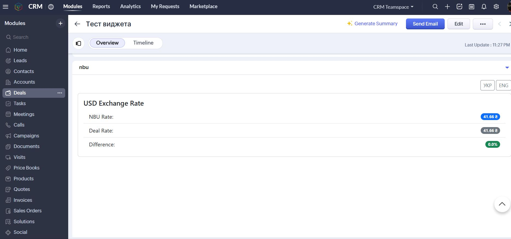
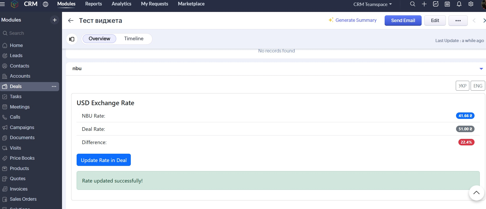

# 📊 Zoho CRM – NBU Exchange Rate Widget

This is a custom widget for Zoho CRM that automatically fetches the current USD exchange rate from the NBU (National Bank of Ukraine) API and allows users to update the "Currency Rate" field within a deal. The widget is integrated into the Deals module as a Related List.

## 🔧 Features

- ✅ Fetches the current USD rate from the NBU API
- ✅ Compares the rate stored in the Deal with the NBU rate
- ✅ Automatically calculates the percentage difference
- ✅ Displays an "Update Rate in Deal" button if the difference is ≥ 5%
- ✅ Internationalization: English and Ukrainian support
- ✅ Responsive UI built with Bootstrap (mobile-friendly)
- ✅ Robust error handling and user feedback
- ✅ Console logging for debugging purposes
- ✅ Caches the NBU rate in localStorage for 1 hour to optimize API calls



## 🧪 Technologies Used

- 📦 HTML + JavaScript
- 🛠️ Zoho CRM Widgets SDK
- 🌐 NBU Public API: bank.gov.ua
- 💅 Bootstrap 5 (via CDN)

## 📦 Project Structure

```
zoho-test/
├── index.html          # Main widget file
└── README.md          # This file
```

## 🚀 Setup and Installation

Follow these steps to get the widget running in your Zoho CRM instance.

### Prerequisites

- Zoho CRM account with administrative access
- Basic knowledge of Git and web hosting

### 1. Clone the Repository

First, clone this repository to your local machine:

```bash
git clone https://github.com/AgentKisa/zoho-test.git
cd zoho-test
```

### 2. Configure Zoho CRM

**Create the Custom Field:**

1. In Zoho CRM, navigate to **Settings → Customization → Modules and Fields → Deals**
2. Create a new field:
   - **Type:** Decimal
   - **Label:** Currency Rate (Курс валют)

**Identify the API Name:**
Find the API Name for this new field (e.g., `field`, `Currency_Rate`). You can check this under **Settings → Developer Hub → APIs & SDKs → API Names → Deals**.

### 3. Configure the Widget Code

1. Open the `index.html` file
2. Locate the `loadRates()` and `updateRate()` functions in the `<script>` block
3. Ensure the API name identified in the previous step matches the key used in the code. In this repository, the default API name used is `field`.

```javascript
// Example: If your API name is different, update these lines:
const dealRate = dealData.field || 0; // Used in loadRates()
APIData: {
    id: recordId,
    field: nbuRate        // Used in updateRate()
}
```

### 4. Deploy the Widget

Zoho Widgets (External Hosting) require a public HTTPS URL.

1. **Host the index.html file:** Use a service like GitHub Pages, Netlify, Vercel, or your own server to host the `index.html` file publicly
2. **Copy the Public URL**

### 5. Install in Zoho CRM

1. In Zoho CRM, go to **Settings → Developer Hub → Widgets**
2. Click **"Create New Widget":**
   - **Name:** NBU Exchange Rate Widget
   - **Type:** Related List
   - **Hosting:** External
   - **Base URL:** Paste the public URL of your hosted `index.html`
3. Save the widget. It will now be available in the Related List of the Deals module.

## 🔁 Workflow

1. When a Deal record is opened, the widget automatically fetches the current NBU rate
2. If the rate in the Deal differs by 5% or more, an update button appears
3. Clicking the button:
   - Updates the "Currency Rate" field in the CRM record
   - Displays a success notification



## 📘 Useful Links

- [Zoho Widgets Documentation](https://www.zoho.com/crm/developer/docs/widgets/)
- [NBU API (Official Documentation)](https://bank.gov.ua/ua/open-data/api-dev)
- [Zoho JS SDK Documentation](https://help.zwidgets.com/help/latest/index.html)

## 👩‍💻 Author

This widget was implemented by **Valeriia Muntian**.

- LinkedIn: [linkedin.com/in/valeriia-muntyan](https://www.linkedin.com/in/valeriia-muntyan/)
- Telegram: @ValeriyaJ

## ⚠️ Notes

- For the CRM update to work, the "Currency Rate" field must be editable and accessible via the API
- Support for other currencies is possible by changing the `valcode` parameter in the NBU API request within `index.html`

## 📄 License

This project is open source and available under the [MIT License](LICENSE).
